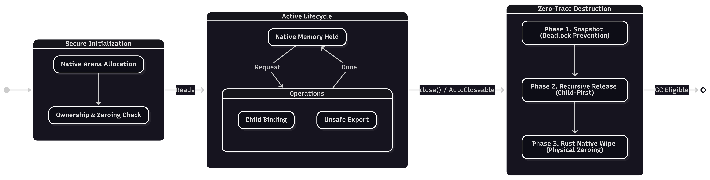

import Highlight from '@site/src/components/DocsDefault';

# 얽힘 라이브러리

얽힘 라이브러리(EntanglementLib)는 퀀트의 고보안 라이브러리로, 이 라이브러리는 **[Rust 기반의 네이티브 코드](https://github.com/Quant-Off/entlib-native)를 [FFM(Foreign Function & Memory) API](https://openjdk.org/jeps/454)를 통해 사용할 수 있도록 브릿징**하며, Rust의 [소유권(ownership) 개념](https://doc.rust-kr.org/ch04-01-what-is-ownership.html)과 [RAII(Resource Acquisition Is Initialization) 패턴](https://doc.rust-lang.org/rust-by-example/scope/raii.html)을 도입해 <Highlight>가비지 컬렉터(Garbase Collector, GC)의 비결정적 소거 문제를 100% 해결</Highlight>했으며, 극강의 성능을 위해 네이티브 함수 호출 속도를 **3-7ns(나노초)** 이하로 줄인 독보적 라이브러리입니다.

<Highlight>양자 컴퓨팅 시대의 위협에 대응하기 위한 양자-내성 암호화(Post-Quantum Cryptography, PQC), 고전 알고리즘</Highlight>을 핵심으로 통합하며, 네이티브에서 모든 연산을 안전히 수행하여 완벽한 보안성을 제공합니다. PQC 알고리즘엔 NIST의 FIPS 표준화된 알고리즘을 기반으로 하며, 기존 고전 암호화 알고리즘(AES, RSA 등)을 포괄적으로 지원하여 하이브리드 보안 환경을 제공합니다.

얽힘 라이브러리는 <Highlight>민감 데이터 컨테이닝, 네이티브 연산, 보안 통신의 3대 요소</Highlight>로 이루어져 있습니다. 주 목적은 개발자들이 안전하고 효율적인 암호화 도구를 쉽고 안전하게 활용할 수 있도록 하는 데 있으며, Java 기반으로 설계되어 대규모 엔터프라이즈에서의 효율적인 마이그레이션을 가능케 합니다.

:::info
벤치마크는 JMH(Java Microbenchmark Harness)를 통해 수행되며, [이 곳](https://github.com/Quant-Off/entanglementlib/blob/master/NATIVE_BENCHMARK.md)에서 벤치마킹 결과에 대한 세부 내용을 확인하실 수 있습니다.
:::

## 주요 기능 및 지원 알고리즘

얽힘 라이브러리의 주요 기능은 크게 **고급 메모리 보안**, **강력한 암호화 알고리즘**, **네이티브 성능 최적화**, **통신 및 유틸리티**로 구분할 수 있습니다.

### 고급 메모리 보안: 잔류 데이터 방지 (Anti-Data Remanence)

가장 독보적인 기능은 Java 언어의 메모리 관리 한계(GC로 인한 데이터 잔류 및 재배치)를 극복했다는 점입니다.

민감한 데이터를 `Java Heap`이 아닌 `Off-Heap`(네이티브 메모리)에 저장하여 GC의 영향(메모리 재배치 등)을 받지 않도록 격리할 수 있습니다. 이는 <Highlight>민감 데이터 컨테이너(Sensitive Data Container)</Highlight>라고 하며 다음의 체계적인 생명주기를 갖습니다.

또한 완벽한 데이터 소거에 대해, <Highlight>데이터의 수명이 다하면 Rust로 작성된 `entlib-native` 네이티브 라이브러리를 호출하여 메모리를 물리적으로 '0'으로 덮어쓰는 방식으로 데이터를 소거</Highlight>합니다. 이는 컴파일러 최적화에 의해 소거 코드가 생략되지 않도록 보장하며, 힙 덤프나 메모리 분석 시에도 민감 정보가 노출되지 않도록 합니다.

Java에서 네이티브 메모리를 용이하게 사용하기 위해 꽤 능동적인 메모리 영역(아레나; Arena) 할당이 필요할 수 있습니다. 이를 위해 `Netty`, `Spring Boot` 등 실행 환경을 감지하고, 스레드 모델에 맞는 최적의 메모리 영역을 자동으로 할당합니다.

### 최신 PQC 및 고전 암호화 지원

NIST 표준을 준수하는 최신 PQC 알고리즘과 검증된 고전 알고리즘을 모두 지원합니다. 모든 암호화 연산은 네이티브에서 수행되어 성능과 보안성을 동시에 확보합니다.

- PQC 암호화
    - 키 캡슐화(Key Encapsulate Mechanism, KEM): [`ML-KEM` (FIPS 203)](https://csrc.nist.gov/pubs/fips/203/final)을 지원하며, `X25519`와 결합한 하이브리드 방식인 [`X25519MLKEM768` 알고리즘](https://www.iana.org/assignments/tls-parameters/tls-parameters.xhtml#:~:text=4588-,X25519MLKEM768,-Y)도 제공하여 과도기적 보안을 보장합니다.
    - 전자 서명(Digital Signature, DS): [`ML-DSA` (FIPS 204)](https://csrc.nist.gov/pubs/fips/204/final) 및 [`SLH-DSA` (FIPS 205)](https://csrc.nist.gov/pubs/fips/205/final)를 지원합니다.
- 고전 암호화
    - `AES`, `ARIA` (블록 암호) 및 `ChaCha20-Poly1305` (AEAD 스트림 암호)를 지원하며, 다양한 운영 모드(`GCM`, `CCM`, `CBC` 등)를 제공합니다.
- 전략 패턴(strategy pattern)
    - 전략 패턴으로 설계된 로직을 통해 알고리즘을 유연하게 교체하거나 등록하여 사용할 수 있는 구조를 갖추고 있습니다.

### 네이티브 성능 최적화 및 아키텍처

자바의 최신 기능인 FFM API를 사용하여 Rust 네이티브 라이브러리와 고성능으로 상호작용합니다.

주요 알고리즘은 <Highlight>SIMD(Single Instruction, Multiple Data) 명령어 셋을 활용하여 병렬 처리를 극대화</Highlight>했으며, 표준 예외 대신 `EntLibSecureException`, `EntLibCryptoException` 등 구체적인 커스텀 예외 클래스를 사용하여 명확한 보안 컨텍스트를 제공하고 체계적인 오류 처리를 지원합니다.

### 보안 통신

보안 통신은 얽힘 라이브러리가 제공하는 3대 핵심 요소 중 하나로, <Highlight>단순한 데이터 전송을 넘어 참여자 간의 신뢰할 수 있는 연결을 보장하는 인프라의 중추</Highlight>입니다.

이 모듈은 **세션의 생성부터 종료까지 모든 상태를 엄격하게 제어하는 세션 관리 시스템과**, 최신 표준을 준수하여 <Highlight>도청 및 변조를 원천 차단하는 강력한 `TLS` 서버 구축 기능을 제공</Highlight>합니다. 개발자는 이 기능을 통해 복잡한 네트워크 보안 로직을 직접 구현할 필요 없이 <Highlight>군사 및 금융 시스템 수준의 안전한 통신 파이프라인을 손쉽게 확보</Highlight>할 수 있으며, 이는 나머지 3대 요소와 결합하여 데이터의 저장과 처리뿐만 아니라 이동하는 순간까지도 빈틈없는 보안성을 보장합니다.

### 개발 유틸리티

암호화 코어 외에도 안전한 시스템 개발을 위한 다양한 모듈을 제공합니다.

- 대용량 데이터 처리를 위한 **청크 프로세서** 및 **I/O** 도구
- 비밀번호 및 민감 문자열을 안전하게 다루는 **버퍼 도구**
- `BouncyCastle` 유틸리티 래퍼, 해싱, 비동기 등 **개발 편의성**을 위한 다양한 도구