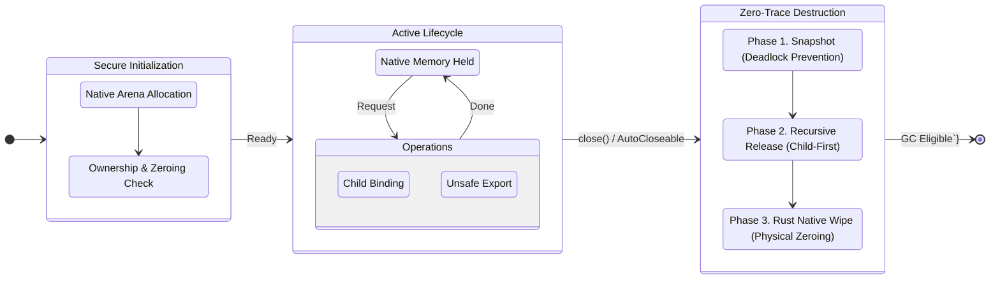

import Highlight from '@site/src/components/DocsDefault';

# 민감 데이터 컨테이너

[`entlib-native` 네이티브 라이브러리](https://github.com/Quant-Off/entlib-native)를 개발하며 얽힘 라이브러리 `1.1.0` 릴리즈에 추가된 주요 기능 중 하나입니다. 이 기능은 민감 데이터(보호가 필요한 정보)를 네이티브에서 안전히 처리할 수 있도록 하는 보안상 아주 중요한 기능을 제공합니다.

꽤 신기하게도 Java에서 Rust의 소유권 개념을 약간 모방하여 만들어졌습니다.

## 배경

Java와 같은 관리되는 런타임(managed runtime) 환경에서 기본 데이터 타입인 바이트 배열(`byte[]`)을 사용하여 민감 정보를 다루는 것은 보안상 취약점을 내포합니다. 사용자가 `Arrays.fill` 등을 통해 명시적으로 데이터를 덮어쓴다(zeroize, wipe) 하더라도, <Highlight>가비지 컬렉터(garbage collector, GC)가 메모리 단편화를 해결하기 위해 객체를 재배치(compaction)하는 과정에서 메모리 어딘가에 원본 데이터의 복제본이 잔존</Highlight>할 수 있습니다.

또한, 힙 메모리는 OS에 의해 디스크로 스왑(swap)될 가능성이 있어 물리적 저장소에 민감 정보가 유출될 위험이 존재합니다. <Highlight>단순히 참조를 해제(`null` 할당)하는 것은 가비지 컬렉션의 대상이 되게 할 뿐</Highlight>, 실제 메모리에 기록된 데이터를 즉시 소거하지 않습니다.

민감 데이터 컨테이너(Sensitive Data Container, SDC)는 이러한 JVM 힙 메모리의 불확실성을 제거하고, 암호화 키, 평문(plaintext), 암호문(ciphertext)과 같은 고위험 데이터를 <Highlight>안전하게 캡슐화하기 위해 설계</Highlight>되었습니다.

## 개요

`SDC`는 양자-내성 암호화(post-quantum cryptography) 및 고전 암호화 환경에서 다루는 민감 정보를 안전하게 캡슐화하고 생명주기를 관리하기 위해 설계된 보안 컨테이너 클래스입니다.

이 클래스는 Java 22부터 정식 도입된 [**FFM API(Foreign Function & Memory API)**](https://openjdk.org/jeps/454)를 기반으로 하며, JVM의 관리 영역을 벗어난 오프-힙(off-heap) 네이티브 메모리에 데이터를 직접 할당하고 <Highlight>[Rust의 소유권(ownership) 모델](https://doc.rust-kr.org/ch04-01-what-is-ownership.html)을 차용하여 데이터의 생명주기를 엄격하게 제어</Highlight>합니다. 이를 통해 키 생성(key generation)이나 암호화 연산 과정에서 발생할 수 있는 메모리 덤프 공격 및 잔존 데이터 노출 위협을 원천적으로 차단합니다.

## 아키텍처 및 설계 원칙

### 메모리 모델

`SDC`는 `java.lang.foreign.Arena`와 `MemorySegment`객체를 사용하여 네이티브 메모리를 직접 할당합니다. 라이브러리 내 [`HeuristicArenaFactory`클래스](https://github.com/Quant-Off/entanglementlib/blob/master/src/main/java/space/qu4nt/entanglementlib/HeuristicArenaFactory.java)를 통해 실행 환경(단일 스레드 vs 비동기 서버 환경)을 분석하고 이에 최적화된 `Arena` 전략을 수립합니다.

- **동적 할당 전략 (heuristic allocation strategy):** `HeuristicArenaFactory`클래스는 시스템 속성(`entanglement.arena.mode`) 또는 런타임 환경(`Netty`, `Spring Boot`, `Tomcat` 등의 클래스 존재 여부)을 감지하여 `Arena#ofConfined()`(스레드 한정) 또는 `Arena#ofShared()`(스레드 공유) 모드를 자동으로 결정합니다.
- **오프-힙 저장 (off-heap storage):** 민감 데이터의 원본은 JVM 힙이 아닌 네이티브 메모리 세그먼트에 저장되며, 이는 `entlib-native` 라이브러리의 Rust 함수들과 직접적으로 상호작용 가능한 형태입니다.

:::note[VM 옵션]
실행 시 VM 옵션에 `-Dentanglement.arena.mode=AUTO`와 같이 전달하여 사용 가능합니다.
:::

### 소유권 및 생명주기

[Rust의 RAII(Resource Acquisition Is Initialization) 패턴](https://doc.rust-lang.org/rust-by-example/scope/raii.html)과 유사하게, `SDC`는 인스턴스화 시점에 자원을 획득하고 `close()` 호출 시점에 자원을 해제합니다.

### 소유권 이전

사실 이 개념은 Java에서 꽤 특이할 수도 있습니다.


생성자에서 `byte[]` 배열을 받을 때 `forceWipe` 플래그가 `true`인 경우, 원본 배열을 네이티브 메모리로 복사한 즉시 덮어쓰기(zeroing)하여 소유권이 컨테이너로 완전히 넘어왔음을 보장합니다.

이 기능은 꽤 엄격합니다. 왜냐하면 사용자가 소유권을 완전히 넘기지 않더라도 넘겨받은 데이터는 자동적으로 소거되기 때문입니다.

:::info[자동 자원 관리]
`SDC`는 `AutoCloseable` 인터페이스를 구현하여 `try-with-resources` 구문을 지원합니다. 이를 통해 예외 발생 시에도 안전한 메모리 해제 및 데이터 소거가 보장됩니다.

<div style={{textAlign: 'center'}}>
    
</div>
:::

### 계층적 바인딩

복잡한 통신 프로토콜 구현을 지원하기 위해, 단일 컨테이너 내에 연관된 다른 `SDC` 인스턴스들을 바인딩할 수 있는 계층 구조를 가집니다. 이는 `#bindings` 리스트를 통해 관리되며, 부모 컨테이너가 종료될 때 자식 컨테이너들도 <Highlight>역순으로 안전하게 종료</Highlight>됩니다.

## 상세 기능 명세

### 생성 및 초기화

생성자는 오프-힙 메모리 할당을 수행하며, 다음 두 가지 모드를 제공합니다.

1. **신규 할당:** 지정된 크기(`allocateSize`)만큼의 빈 네이티브 메모리 블록을 생성합니다. 
2. **데이터 래핑:** 기존 `byte[]` 데이터를 네이티브 메모리로 복사(`Arena#allocateFrom(...)`)합니다. 이때 `KeyDestroyHelper`클래스를 통해 원본 힙 메모리의 즉각적인 소거를 선택할 수 있습니다.

### 데이터 내보내기 및 직렬화

보안상의 이유로 <Highlight>네이티브 메모리의 데이터는 직접 접근이 제한</Highlight>됩니다. 외부 전송이나 직렬화가 필요한 경우 명시적인 `#exportData()` 호출이 필요합니다.

* **힙으로의 복사:** `#exportData()`는 네이티브 세그먼트의 데이터를 JVM 힙 내의 `#segmentData` 필드로 복사하는 메소드입니다.
* **접근 제어:** 이미 소거된 컨테이너에 대해 접근을 시도할 경우 [`EntLibSecureIllegalStateException`](https://github.com/Quant-Off/entanglementlib/blob/master/src/main/java/space/qu4nt/entanglementlib/exception/secure/EntLibSecureIllegalStateException.java)예외를 발생시킵니다.
* **포맷 지원:** 원본 바이트 배열의 안전한 복사본, `ByteBuffer`, 또는 Base64 인코딩된 문자열 형태로 데이터를 반환하는 유틸리티 메소드를 제공합니다.

### 보안 소거

`SDC`의 가장 핵심적인 기능은 `close()` 메소드 내에서 수행되는 다층적 데이터 소거 로직입니다. 소거 절차는 다음 로직으로 엄격하게 진행됩니다.


1. **하위 컨테이너 소거:** `#bindings` 리스트에 등록된 자식 컨테이너들을 역순으로 닫습니다.
2. **네이티브 메모리 소거:** [`InternalFactory`](https://github.com/Quant-Off/entanglementlib/blob/master/src/main/java/space/qu4nt/entanglementlib/InternalFactory.java)클래스를 통해 `entlib-native`의 [`entanglement_secure_wipe` 함수](https://github.com/Quant-Off/entlib-native/blob/249db3b603842c968d71d0f2ee37a59b3ffd91c8/src/modules/secure_wipe.rs#L34)를 호출합니다. 이는 컴파일러 최적화에 의해 생략되지 않는 안전한 메모리 덮어쓰기를 수행합니다.
3. **힙 메모리 소거:** 클래스 내 멤버 변수인 `#fromData`(원본 참조)와 `#segmentData`(내보내기 된 데이터)를 `KeyDestroyHelper`를 사용하여 덮어씁니다.
4. **자원 해제:** `Arena#close()`를 호출하여 운영체제에 메모리를 반환합니다.

### API 시그니처

현재 얽힘 라이브러리 `1.1.0-Alpha` 에서 `SDC`는 다음의 API 시그니처로 나타낼 수 있습니다.

| 메소드                                       | 설명                         | 비고                               |
|-------------------------------------------|----------------------------|----------------------------------|
| `SensitiveDataContainer(int)`             | 지정된 크기의 빈 컨테이너 생성          | 오프-힙 할당                          |
| `SensitiveDataContainer(byte[], boolean)` | 바이트 배열을 기반으로 컨테이너 생성       | `forceWipe=true` 시 원본 즉시 소거      |
| `addContainerData(...)`                   | 하위 컨테이너를 생성하여 현재 인스턴스에 바인딩 | 연쇄적(chaining) 호출 가능              |
| `exportData()`                            | 네이티브 데이터를 힙 메모리로 복사        | 직렬화 전 필수 호출                      |
| `getSegmentData()`                        | 복사된 데이터의 사본 반환             | `#exportData()` 선행 필요            |
| `close()`                                 | 모든 데이터 소거 및 메모리 해제         | `entanglement_secure_wipe` 함수 호출 |

## 보안 고려사항

* **스레드 한정**
    - `HeuristicArenaFactory`클래스가 `Arena#ofConfined()`를 반환하는 경우, <Highlight>해당 컨테이너는 생성된 스레드 외부에서 접근할 수 없습니다.</Highlight> 이는 동시성 공격(race condition)을 원천 차단하지만, 스레드 간 데이터 공유 시 `ArenaMode#SHARED` 설정이 선행되어야 함을 의미합니다.
* **메모리 덤프 방어**
    - 핵심 키 데이터가 JVM 힙에 머무르는 시간을 최소화(생성 직후 네이티브로 이동 및 힙 소거)하여, 힙 덤프 분석을 통한 키 탈취 시나리오에 강력하게 대응합니다.
* **GC 의존성 제거**
    - Java의 GC는 <Highlight>객체가 언제 메모리에서 해제될지 보장하지 않으며, 해제 후 데이터가 0으로 덮어써지는지도 보장하지 않습니다.</Highlight> 본 클래스는 명시적인 `close()` 호출을 통해 이 불확실성을 제거합니다.

:::warning
민감 데이터가 아닌 데이터를 `SDC`에 포함**할 수는 있지만** 권장되지 않습니다. 상황에 맞게 유연히 사용할 필요가 있습니다.
:::

## 사용 예시

`SDC`는 다양한 배포 환경과 보안 요구사항을 충족하기 위해 유연한 설정 및 사용 패턴을 지원합니다. 아래는 앞서 잠시 설명했듯 VM 옵션을 통한 전역 설정 방법과 주요 코드 사용 패턴입니다.

### VM 옵션을 통한 아레나 모드 설정

`HeuristicArenaFactory`클래스는 기본적으로 <Highlight>런타임 환경(프레임워크 감지)을 분석하여 최적의 아레나 모드를 결정</Highlight>합니다. 그러나 특정 보안 정책 준수나 디버깅, 또는 프레임워크 감지가 불가능한 커스텀 환경을 위해 사용자가 직접 모드를 강제할 수 있습니다.

애플리케이션 시작 시 JVM 옵션(system property)으로 `entanglement.arena.mode` 값을 전달하여 전역 설정을 제어합니다.

##### 설정 옵션

- `-Dentanglement.arena.mode=CONFINED`: **(보안 권장)** 오직 생성된 스레드에서만 접근을 허용합니다. 가장 강력한 메모리 보호를 제공합니다.
- `-Dentanglement.arena.mode=SHARED`: 비동기 환경이나 멀티 스레드 간 데이터 공유가 필수적인 경우 사용합니다.
- `-Dentanglement.arena.mode=AUTO` 또는 *누락*: 사용자의 환경에 따라 `CONFINED`, `SHARED`로 자동 설정됩니다.

##### 실행 예시

```bash
# 비동기 서버 환경에서 강제로 SHARED 모드로 실행하는 경우
$ java -Dentanglement.arena.mode=SHARED -jar your-application.jar
```

### 기본 수명주기 관리

가장 표준적인 사용 패턴으로, `try-with-resources` 구문을 사용하여 예외 발생 여부와 관계없이 즉각적인 데이터 소거를 보장합니다.

```java showLineNumbers=1 title="SDC 수명주기 테스트"
import space.qu4nt.entanglementlib.entlibnative.SensitiveDataContainer;

public void processSecureData(byte[] rawKeyBytes) {
// highlight-start
    // 컨테이너 생성: 원본 rawKeyBytes는 즉시 힙에서 소거(zeroize)되고 네이티브로 이동됨
    try (SensitiveDataContainer container = new SensitiveDataContainer(rawKeyBytes, true)) {
// highlight-end

        // 네이티브 라이브러리 연산 수행 (MemorySegment 포인터 전달)
        // ...보안 로직 수행
        nativeCryptoFunction(container.getMemorySegment());
// highlight-start
        // (경우에 따라) 결과 데이터 내보내기
        // 네이티브 메모리의 데이터를 힙으로 안전하게 복사
        container.exportData();
        String safeBase64 = container.getSegmentDataBase64();
// highlight-end
        System.out.println("Processed Data: " + safeBase64);

    } catch (Exception e) {
        // 예외 처리 로직
        log.error("Secure operation failed", e);
    }
    // 종료 시...
    // - 네이티브 메모리 영역 소거
    // - 힙에 복사된 segmentData 소거
    // - Arena 종료 및 메모리 반환
}
```

이러한 수명주기는 간략하게 다음과 같이 다이어그램으로 나타낼 수 있습니다.



[//]: # (![]&#40;https://velog.velcdn.com/images/quant-t-f/post/a2309d51-db14-403c-aa22-f8c3b73a7ad7/image.png&#41;)

### 계층적 데이터 바인딩

TLS같은 통신 프로토콜 구현 시, 세션 키와 초기화 벡터(IV) 또는 관련 메타데이터를 하나의 생명주기로 관리해야 할 때가 많습니다. 이 때 `#addContainerData`메소드를 사용하면 부모 컨테이너가 닫힐 때 자식 컨테이너들도 연쇄적으로 안전하게 소거됩니다.

```java showLineNumbers=1 title="계층적 데이터 바인딩 테스트"
import space.qu4nt.entanglementlib.entlibnative.SensitiveDataContainer;

public void establishSecureSession(byte[] masterKey, byte[] iv) {
// highlight-start
    // 마스터 키 컨테이너 생성 (루트 컨테이너)
    try (SensitiveDataContainer keyContainer = new SensitiveDataContainer(masterKey, true)) {
// highlight-end
        // IV(초기화 벡터)를 마스터 키 컨테이너에 바인딩
        // 별도의 try-catch 블록이나 close 호출이 필요 없음
// highlight-start
        SensitiveDataContainer ivContainer = keyContainer.addContainerData(iv, true);
// highlight-end
        // 추가적인 파생 키 등을 위한 빈 버퍼 할당 및 바인딩
// highlight-start
        SensitiveDataContainer derivedBuffer = keyContainer.addContainerData(64);
// highlight-end

        // ...보안 로직 수행
        // 이 시점에 keyContainer, ivContainer, derivedBuffer 모두 활성 상태

    }
    // 종료 시...
    // 1. derivedBuffer 소거 및 닫기
    // 2. ivContainer 소거 및 닫기
    // 3. keyContainer 소거 및 닫기
    // 역순으로 안전하게 해제
}
```