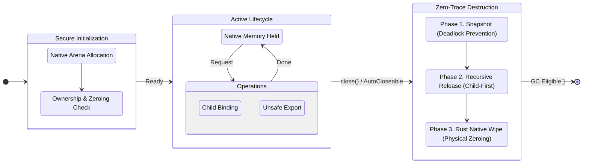

import Highlight from '@site/src/components/DocsDefault';

# Sensitive Data Container

This is one of the key features added in the EntanglementLib `1.1.0` release while developing the [`entlib-native` native library](https://github.com/Quant-Off/entlib-native). It provides a critical security function that allows sensitive data (information requiring protection) to be safely processed natively.

Interestingly enough, it was created by slightly mimicking Rust's ownership concept in Java.

## Background

Handling sensitive information using byte arrays (`byte[]`), a basic data type in a managed runtime environment like Java, implies security vulnerabilities. Even if a user explicitly overwrites data (zeroize, wipe) using `Arrays.fill`, etc., <Highlight>a copy of the original data may remain somewhere in memory during the process of the garbage collector (GC) relocating objects (compaction) to resolve memory fragmentation</Highlight>.

In addition, heap memory may be swapped to disk by the OS, posing a risk of sensitive information leaking to physical storage. <Highlight>Simply releasing the reference (assigning `null`) only makes it eligible for garbage collection</Highlight>, and does not immediately erase the data recorded in actual memory.

The Sensitive Data Container (SDC) is <Highlight>designed to safely encapsulate</Highlight> high-risk data such as encryption keys, plaintext, and ciphertext, eliminating these uncertainties of JVM heap memory.

## Overview

`SDC` is a security container class designed to safely encapsulate sensitive information handled in post-quantum cryptography and classical encryption environments and manage its lifecycle.

This class is based on the [**FFM API (Foreign Function & Memory API)**](https://openjdk.org/jeps/454), which was officially introduced in Java 22. It allocates data directly to off-heap native memory outside the JVM's management area and <Highlight>strictly controls the lifecycle of data by borrowing [Rust's ownership model](https://doc.rust-kr.org/ch04-01-what-is-ownership.html)</Highlight>. This fundamentally blocks memory dump attacks and residual data exposure threats that may occur during key generation or encryption operations.

## Architecture and Design Principles

### Memory Model

`SDC` directly allocates native memory using `java.lang.foreign.Arena` and `MemorySegment` objects. The [`HeuristicArenaFactory` class](https://github.com/Quant-Off/entanglementlib/blob/master/src/main/java/space/qu4nt/entanglementlib/HeuristicArenaFactory.java) in the library analyzes the execution environment (single-threaded vs. asynchronous server environment) and establishes an optimized `Arena` strategy.

- **Heuristic allocation strategy:** The `HeuristicArenaFactory` class detects system properties (`entanglement.arena.mode`) or the runtime environment (presence of classes such as `Netty`, `Spring Boot`, `Tomcat`, etc.) and automatically determines `Arena#ofConfined()` (thread-confined) or `Arena#ofShared()` (thread-shared) modes.
- **Off-heap storage:** The original sensitive data is stored in a native memory segment, not the JVM heap, which is in a form that can directly interact with Rust functions in the `entlib-native` library.

:::note[VM Options]
It can be used by passing VM options such as `-Dentanglement.arena.mode=AUTO` at runtime.
:::

### Ownership and Lifecycle

Similar to [Rust's RAII (Resource Acquisition Is Initialization) pattern](https://doc.rust-lang.org/rust-by-example/scope/raii.html), `SDC` acquires resources at instantiation and releases them when `close()` is called.

### Ownership Transfer

In fact, this concept might be quite unique in Java.


When receiving a `byte[]` array in the constructor, if the `forceWipe` flag is `true`, it guarantees that ownership has been completely transferred to the container by overwriting (zeroing) the original array immediately after copying it to native memory.

This feature is quite strict. This is because even if the user does not completely transfer ownership, the transferred data is automatically erased.

:::info[Automatic Resource Management]
`SDC` implements the `AutoCloseable` interface to support the `try-with-resources` syntax. This ensures safe memory release and data erasure even when an exception occurs.

<div style={{textAlign: 'center'}}>
    
</div>
:::

### Hierarchical Binding

To support complex communication protocol implementations, it has a hierarchical structure that allows binding other associated `SDC` instances within a single container. This is managed through the `#bindings` list, and when the parent container is terminated, child containers are also <Highlight>safely terminated in reverse order</Highlight>.

## Detailed Feature Specification

### Creation and Initialization

The constructor performs off-heap memory allocation and provides two modes:

1. **New Allocation:** Creates an empty native memory block of the specified size (`allocateSize`). 
2. **Data Wrapping:** Copies existing `byte[]` data to native memory (`Arena#allocateFrom(...)`). At this time, you can choose immediate erasure of the original heap memory through the `KeyDestroyHelper` class.

### Data Export and Serialization

For security reasons, <Highlight>direct access to data in native memory is restricted</Highlight>. If external transmission or serialization is required, an explicit `#exportData()` call is required.

* **Copy to Heap:** `#exportData()` is a method that copies data from the native segment to the `#segmentData` field in the JVM heap.
* **Access Control:** Attempting to access an already erased container throws an [`EntLibSecureIllegalStateException`](https://github.com/Quant-Off/entanglementlib/blob/master/src/main/java/space/qu4nt/entanglementlib/exception/secure/EntLibSecureIllegalStateException.java).
* **Format Support:** Utility methods are provided to return data in the form of a safe copy of the original byte array, `ByteBuffer`, or Base64 encoded string.

### Secure Erasure

The core feature of `SDC` is the multi-layered data erasure logic performed within the `close()` method. The erasure procedure proceeds strictly in the following order:


1. **Child Container Erasure:** Closes child containers registered in the `#bindings` list in reverse order.
2. **Native Memory Erasure:** Calls the [`entanglement_secure_wipe` function](https://github.com/Quant-Off/entlib-native/blob/249db3b603842c968d71d0f2ee37a59b3ffd91c8/src/modules/secure_wipe.rs#L34) of `entlib-native` through the [`InternalFactory`](https://github.com/Quant-Off/entanglementlib/blob/master/src/main/java/space/qu4nt/entanglementlib/InternalFactory.java) class. This performs safe memory overwriting that is not omitted by compiler optimization.
3. **Heap Memory Erasure:** Overwrites the class member variables `#fromData` (original reference) and `#segmentData` (exported data) using `KeyDestroyHelper`.
4. **Resource Release:** Calls `Arena#close()` to return memory to the operating system.

### API Signature

Currently, in EntanglementLib `1.1.0-Alpha`, `SDC` can be represented by the following API signature.

| Method                                    | Description                                     | Note                                 |
|-------------------------------------------|-------------------------------------------------|--------------------------------------|
| `SensitiveDataContainer(int)`             | Creates an empty container of specified size    | Off-heap allocation                  |
| `SensitiveDataContainer(byte[], boolean)` | Creates a container based on byte array         | Immediate source erasure if `forceWipe=true` |
| `addContainerData(...)`                   | Creates a child container and binds to current instance | Chaining calls possible              |
| `exportData()`                            | Copies native data to heap memory               | Mandatory call before serialization  |
| `getSegmentData()`                        | Returns a copy of the copied data               | `#exportData()` required beforehand  |
| `close()`                                 | Erases all data and releases memory             | Calls `entanglement_secure_wipe` function |

## Security Considerations

* **Thread Confinement**
    - If the `HeuristicArenaFactory` class returns `Arena#ofConfined()`, <Highlight>the container cannot be accessed outside the created thread.</Highlight> This fundamentally blocks race condition attacks, but implies that `ArenaMode#SHARED` setting must precede data sharing between threads.
* **Memory Dump Defense**
    - Minimizes the time key data stays in the JVM heap (moves to native immediately after creation and erases heap), strongly responding to key theft scenarios through heap dump analysis.
* **GC Dependency Removal**
    - Java's GC <Highlight>does not guarantee when an object will be released from memory, nor does it guarantee that data is overwritten with 0 after release.</Highlight> This class eliminates this uncertainty through explicit `close()` calls.

:::warning
You **can** include non-sensitive data in `SDC`, but it is not recommended. It needs to be used flexibly according to the situation.
:::

## Usage Examples

`SDC` supports flexible configuration and usage patterns to meet various deployment environments and security requirements. Below are the global configuration method via VM options and major code usage patterns as briefly explained earlier.

### Arena Mode Configuration via VM Options

The `HeuristicArenaFactory` class basically <Highlight>analyzes the runtime environment (framework detection) to determine the optimal arena mode</Highlight>. However, users can force a mode manually for compliance with specific security policies, debugging, or custom environments where framework detection is impossible.

Control global settings by passing the `entanglement.arena.mode` value as a JVM option (system property) at application startup.

##### Configuration Options

- `-Dentanglement.arena.mode=CONFINED`: **(Security Recommended)** Allows access only from the created thread. Provides the strongest memory protection.
- `-Dentanglement.arena.mode=SHARED`: Use when data sharing between asynchronous environments or multi-threads is essential.
- `-Dentanglement.arena.mode=AUTO` or *Omitted*: Automatically set to `CONFINED` or `SHARED` depending on the user's environment.

##### Execution Example

```bash
# Forcing SHARED mode in an asynchronous server environment
$ java -Dentanglement.arena.mode=SHARED -jar your-application.jar
```

### Basic Lifecycle Management

This is the most standard usage pattern, using the `try-with-resources` syntax to guarantee immediate data erasure regardless of exceptions.

```java showLineNumbers=1 title="SDC Lifecycle Test"
import space.qu4nt.entanglementlib.entlibnative.SensitiveDataContainer;

public void processSecureData(byte[] rawKeyBytes) {
// highlight-start
    // Create container: Original rawKeyBytes is immediately erased (zeroized) from heap and moved to native
    try (SensitiveDataContainer container = new SensitiveDataContainer(rawKeyBytes, true)) {
// highlight-end

        // Perform native library operation (Pass MemorySegment pointer)
        // ...Perform security logic
        nativeCryptoFunction(container.getMemorySegment());
// highlight-start
        // (Optional) Export result data
        // Safely copy data from native memory to heap
        container.exportData();
        String safeBase64 = container.getSegmentDataBase64();
// highlight-end
        System.out.println("Processed Data: " + safeBase64);

    } catch (Exception e) {
        // Exception handling logic
        log.error("Secure operation failed", e);
    }
    // On termination...
    // - Erase native memory area
    // - Erase segmentData copied to heap
    // - Close Arena and return memory
}
```

This lifecycle can be briefly represented in a diagram as follows:



[//]: # (![]&#40;https://velog.velcdn.com/images/quant-t-f/post/a2309d51-db14-403c-aa22-f8c3b73a7ad7/image.png&#41;)

### Hierarchical Data Binding

When implementing communication protocols like TLS, session keys and initialization vectors (IV) or related metadata often need to be managed with a single lifecycle. In this case, using the `#addContainerData` method ensures that child containers are also safely erased in a chain when the parent container is closed.

```java showLineNumbers=1 title="Hierarchical Data Binding Test"
import space.qu4nt.entanglementlib.entlibnative.SensitiveDataContainer;

public void establishSecureSession(byte[] masterKey, byte[] iv) {
// highlight-start
    // Create master key container (Root container)
    try (SensitiveDataContainer keyContainer = new SensitiveDataContainer(masterKey, true)) {
// highlight-end
        // Bind IV (Initialization Vector) to master key container
        // No separate try-catch block or close call needed
// highlight-start
        SensitiveDataContainer ivContainer = keyContainer.addContainerData(iv, true);
// highlight-end
        // Allocate empty buffer for additional derived keys, etc. and bind
// highlight-start
        SensitiveDataContainer derivedBuffer = keyContainer.addContainerData(64);
// highlight-end

        // ...Perform security logic
        // At this point, keyContainer, ivContainer, derivedBuffer are all active

    }
    // On termination...
    // 1. Erase and close derivedBuffer
    // 2. Erase and close ivContainer
    // 3. Erase and close keyContainer
    // Released safely in reverse order
}
```